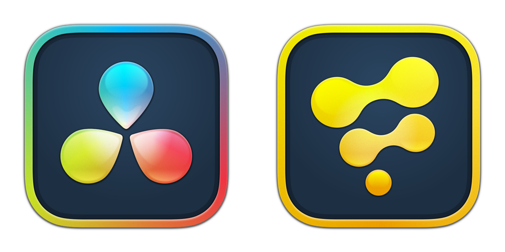

# CesiumLink (WIP)

> The ultimate 3D tile rendering solution for XR content creators.
>
> Enjoy!
>

Welcome to the development repo for "CesiumLink" — a [Cesium native API](https://github.com/CesiumGS/cesium-native#readme) integration plugin created for the Kartaverse XR pipeline.

- The Kartaverse 6 launch is planned for [Dec 24, 2024](https://days.to/christmas-eve/2024/12/24)
- CesiumLink (WIP) is being created in West Dover, Nova Scotia, Canada 🇨🇦

# Overview

With the CesiumLink data nodes you can effortlessly work with 3D tile geospatial data inside your favorite node based XR toolsets.

# Broad DCC Support Planned

The new Kartaverse CesiumLink toolset is being created with the goal of initially supporting BMD [Resolve (Free)](https://www.blackmagicdesign.com/products/davinciresolve)/[Resolve Studio](https://www.blackmagicdesign.com/products/davinciresolve)/[Fusion Studio](https://www.blackmagicdesign.com/products/fusion), and SideFX [Houdini Indie](https://www.sidefx.com/products/whats-new-in-h205/) (TOPs/Solaris/Copernicus) on Kartaverse 6's official launch day.

## SideFX Houdini Indie Compatible

## BMD Resolve/Fusion Compatible

